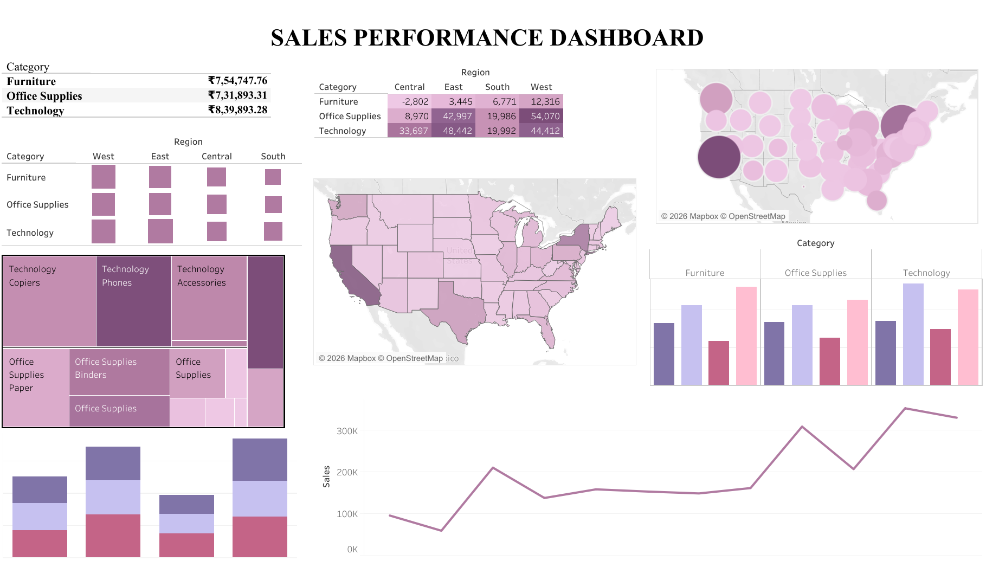

<div align="center">

# 📊 Executive Sales Intelligence Dashboard

### Interactive Business Intelligence Solution for Sales, Profitability & Regional Performance Analysis using Tableau

<br>


</div>

**Nagarjuna Degree College**
Subject: Business Analytics — MBA 2nd Semester

</div>

<br>


---

# 🖼 Dashboard Preview

<div align="center">

### Executive Sales Analytics Dashboard


<br><br>

### Executive Sales Performance Dashboard



</div>


# 🚀 Live Interactive Dashboards

<div align="center">

Explore the interactive Tableau dashboards published on Tableau Public. These dashboards allow you to interact with filters, explore visualizations, and analyze the data directly in your browser without downloading the workbook.

| Dashboard | Live Link |
|------------|-----------|
| 📈 **Sales Analytics Dashboard** | **[View on Tableau Public](https://public.tableau.com/app/profile/rakshitha.m.m4396/viz/SalesAnalyticsDashboard_17857620962110/SalesAnalytics)** |
| 📊 **Sales Performance Dashboard** | **[View on Tableau Public](https://public.tableau.com/app/profile/rakshitha.m.m4396/viz/SalesPerformanceDashboard_17857583223040/Dashboard1)** |

</div>

> 💡 **Tip:** Click any dashboard link above to explore the interactive visualizations, apply filters, and drill down into business insights directly on Tableau Public. Tableau Public is designed for sharing interactive dashboards online, making it easy for recruiters and reviewers to explore your work without installing Tableau Desktop. :contentReference[oaicite:0]{index=0}

---
---
---

## Table of Contents

- [Project Objective](#project-objective)
- [Course Details](#course-details)
- [Business Problem](#business-problem)
- [Dataset Overview](#dataset-overview)
- [Dashboard Architecture](#dashboard-architecture)
- [Dashboard Walkthrough — Sales Analytics](#dashboard-walkthrough--sales-analytics)
- [Dashboard Walkthrough — Sales Performance](#dashboard-walkthrough--sales-performance)
- [Key Performance Indicators](#key-performance-indicators)
- [Calculated Fields](#calculated-fields)
- [Filters &amp; Quick Filters](#filters--quick-filters)
- [Dashboard Actions (Interactivity)](#dashboard-actions-interactivity)
- [Data-Driven Findings](#data-driven-findings)
- [Tools &amp; Techniques Used](#tools--techniques-used)
- [Project File Structure](#project-file-structure)
- [How to View the Dashboard](#how-to-view-the-dashboard)
- [Screenshots](#screenshots)
- [Learning Outcomes](#learning-outcomes)
- [Scope for Future Enhancement](#scope-for-future-enhancement)
- [Acknowledgements](#acknowledgements)

---


# 📌 Project Snapshot

| Attribute | Details |
|------------|----------|
| 📊 Dashboards | 2 Interactive Dashboards |
| 📄 Worksheets | 18 |
| 📦 Records | 10,194 |
| 🛒 Orders | 5,111 |
| 👥 Customers | 804 |
| 🌎 Regions | 4 |
| 📂 Categories | 3 |
| 🛠 Tool | Tableau Desktop 2026.2.1 |
| 📁 Workbook | `.twbx` |
## Project Objective

This project applies Business Analytics concepts learned in MBA coursework to a real-world style retail dataset, using **Tableau** to design a two-dashboard analytical solution. The objective is to demonstrate the ability to:

- Translate raw transactional data into decision-ready business dashboards.
- Identify sales trends, profitability patterns, and regional performance gaps using data visualization.
- Apply dashboard design principles (KPI placement, filters, interactivity, cross-dashboard actions) taught as part of the course.
- Draw verifiable, data-backed business insights rather than assumptions.

---

## Details

<div align="center">

| Detail | Information |
|---|---|
| Tool Used | Tableau Desktop (version 2026.2.1) |
| Deliverable | Interactive Tableau Dashboard (.twbx) |
| Dataset | Sample Superstore (Orders) |

</div>

---

## Business Problem

A retail distributor operating across four U.S. regions (**West, East, Central, South**) and three product categories (**Technology, Furniture, Office Supplies**) needs a way to answer three core management questions, which this project is scoped to address:

1. **Where is revenue being generated**, and how is it trending over time?
2. **Where is profit being lost** — which categories, sub-categories, and regions strengthen margin versus which ones erode it?
3. **How does performance vary geographically**, down to the state level, to support decisions on inventory, discounting, and regional sales strategy?

---

# ❓ Business Questions Answered

- Which region contributes the highest sales and profit?
- Which product categories drive the most revenue?
- Which sub-categories are loss-making?
- How do sales and profit change over time?
- Which states require management attention?
- Which customer segment generates the highest revenue?
- Where are profit margins declining?
- Which products contribute the most to business growth?

---
## Dataset Overview

<div align="center">

| Attribute | Value |
|---|---|
| Source Table | `Orders (sample_-_superstore (1))` |
| Storage Format | Tableau Hyper Extract (embedded in `.twbx`) |
| Total Records | 10,194 order lines |
| Distinct Orders | 5,111 |
| Distinct Customers | 804 |
| Date Range | January 3, 2023 – December 30, 2026 |
| Geographic Scope | United States (Region → State/Province → City) |
| Product Hierarchy | Category → Sub-Category → Product Name |

</div>

**Fields available in the source table:**

<table>
<tr>
<th>Category</th>
<th>Fields</th>
</tr>
<tr>
<td><b>Order Detail</b></td>
<td>Row ID, Order ID, Order Date, Ship Date, Ship Mode</td>
</tr>
<tr>
<td><b>Customer</b></td>
<td>Customer ID, Customer Name, Segment</td>
</tr>
<tr>
<td><b>Geography</b></td>
<td>Country/Region, City, State/Province, Postal Code, Region</td>
</tr>
<tr>
<td><b>Product</b></td>
<td>Product ID, Category, Sub-Category, Product Name</td>
</tr>
<tr>
<td><b>Metrics</b></td>
<td>Sales, Quantity, Discount, Profit</td>
</tr>
</table>

Two calculated bin fields — **Sales (bin)** and **Profit (bin)** — extend the Profit measure into discrete buckets to support the Histogram worksheet.

---

## Dashboard Architecture

<div align="center">

```
Sales Performance Dashboard Final.twbx
│
├── Sales Analytics (Dashboard 1)
│   ├── KPI – Total Sales           KPI – Total Profit
│   ├── Circle View                 Dual Line Chart
│   ├── Scatter Plot                Pie Chart
│   ├── Gantt Chart                 Histogram
│   └── Action: Circle View click → cross-filters dashboard
│
└── Sales Performance (Dashboard 2)
    ├── Text Table                  Highlight Table
    ├── Heat Map                    Symbol Map
    ├── Filled Map                  Tree Map
    ├── Side-by-Side Bar Chart      Stacked Bar Chart
    ├── Line Chart
    └── Action: Tree Map click → cross-filters dashboard
```

</div>

---

## Dashboard Walkthrough — Sales Analytics

Fixed 1366 × 768 canvas combining two headline KPI tiles with six supporting visualizations focused on profitability and time-based trends.

<table>
<tr>
<th>Worksheet</th>
<th>Chart Type</th>
<th>Fields Used</th>
<th>Purpose</th>
</tr>
<tr>
<td>KPI – Total Sales</td>
<td>Single-value text KPI</td>
<td>SUM(Sales)</td>
<td>Headline sales figure for the period</td>
</tr>
<tr>
<td>KPI – Total Profit</td>
<td>Single-value text KPI</td>
<td>SUM(Profit)</td>
<td>Headline profit figure for the period</td>
</tr>
<tr>
<td>Circle View</td>
<td>Circle / bar hybrid, sized &amp; colored by Category</td>
<td>Category, SUM(Sales), SUM(Profit)</td>
<td>Compares Sales vs. Profit by category; acts as the dashboard's filter source</td>
</tr>
<tr>
<td>Dual Line Chart</td>
<td>Dual-axis line chart, colored by Measure Names</td>
<td>Order Date (monthly), SUM(Sales), SUM(Profit), Category</td>
<td>Tracks Sales and Profit trends over time side by side</td>
</tr>
<tr>
<td>Scatter Plot</td>
<td>Scatter, shaped by Category, colored by Sub-Category</td>
<td>SUM(Sales), SUM(Profit)</td>
<td>Identifies sub-categories that are high-revenue but low- or negative-margin</td>
</tr>
<tr>
<td>Pie Chart</td>
<td>Pie, wedge size by Sales</td>
<td>Category, SUM(Sales)</td>
<td>Shows each category's share of total sales</td>
</tr>
<tr>
<td>Gantt Chart</td>
<td>Gantt bars, sized by Sales, colored by Category</td>
<td>Order ID, Order Date, Category, SUM(Sales)</td>
<td>Visualizes order timing and duration across the order lifecycle</td>
</tr>
<tr>
<td>Histogram</td>
<td>Binned column chart</td>
<td>Profit (bin), COUNT(Profit)</td>
<td>Shows the distribution of profit across all order lines, exposing loss-making outliers</td>
</tr>
</table>

---

## Dashboard Walkthrough — Sales Performance

Fixed 1366 × 768 canvas combining nine visualizations that break performance down by region, state, and product hierarchy.

<table>
<tr>
<th>Worksheet</th>
<th>Chart Type</th>
<th>Fields Used</th>
<th>Purpose</th>
</tr>
<tr>
<td>Text Table</td>
<td>Crosstab</td>
<td>Category, Sub-Category, SUM(Sales)</td>
<td>Precise sales figures by product hierarchy for reference</td>
</tr>
<tr>
<td>Highlight Table</td>
<td>Heat-shaded crosstab, colored &amp; labeled by Profit</td>
<td>Region, Category, SUM(Profit)</td>
<td>Flags region/category combinations that under- or over-perform on profit</td>
</tr>
<tr>
<td>Heat Map</td>
<td>Size-encoded matrix</td>
<td>Category, Region, SUM(Sales)</td>
<td>Compares sales intensity across category and region simultaneously</td>
</tr>
<tr>
<td>Symbol Map</td>
<td>Proportional symbol map, sized by Profit, colored by Sales</td>
<td>Country/Region, State/Province, SUM(Sales), SUM(Profit)</td>
<td>Geographic view of profit vs. sales concentration by state</td>
</tr>
<tr>
<td>Filled Map</td>
<td>Choropleth (filled polygon) map</td>
<td>State/Province, SUM(Sales)</td>
<td>State-level sales intensity across the U.S.</td>
</tr>
<tr>
<td>Tree Map</td>
<td>Tree map, sized by Profit, colored by Sales</td>
<td>Category, Sub-Category, SUM(Sales), SUM(Profit)</td>
<td>Hierarchical view of product performance; acts as the dashboard's filter source</td>
</tr>
<tr>
<td>Side-by-Side Bar Chart</td>
<td>Clustered bar, colored by Region</td>
<td>Category, Sub-Category, Region, SUM(Sales)</td>
<td>Direct regional comparison within each product category</td>
</tr>
<tr>
<td>Stacked Bar Chart</td>
<td>Stacked bar, colored by Category</td>
<td>Region, Category, SUM(Sales)</td>
<td>Composition of regional sales by category</td>
</tr>
<tr>
<td>Line Chart</td>
<td>Time series</td>
<td>Order Date (monthly), Category, Sub-Category, SUM(Sales)</td>
<td>Sales trend over time, viewable by category/sub-category</td>
</tr>
</table>

---

## Key Performance Indicators

<div align="center">

| KPI | Value | Verified Against |
|---|---|---|
| **Total Sales** | $2,326,534.35 | SUM(Sales), embedded Hyper extract |
| **Total Profit** | $292,296.81 | SUM(Profit), embedded Hyper extract |
| **Overall Profit Margin** | 12.56% | Profit ÷ Sales |
| **Total Orders** | 5,111 | COUNT(DISTINCT Order ID) |
| **Total Customers** | 804 | COUNT(DISTINCT Customer ID) |
| **Total Units Sold** | 38,654 | SUM(Quantity) |

</div>

The KPI-Total Sales and KPI-Total Profit worksheets render these two headline figures directly on the Sales Analytics dashboard as single-value text tiles.

---

## Calculated Fields

<div align="center">

| Field Name | Formula | Type | Purpose |
|---|---|---|---|
| Profit (bin) | `[Profit]` | Binned Integer | Groups individual order-line profit values into intervals for the Histogram |
| Sales (bin) | `[Sales]` | Binned Integer | Groups individual order-line sales values into intervals for distribution analysis |

</div>

Both fields are Tableau-native **bin** calculations applied directly to the Profit and Sales measures; no custom LOD, table, or string calculations are used elsewhere in the workbook.

---

## Filters &amp; Quick Filters

<table>
<tr>
<th>Worksheet</th>
<th>Filter Applied</th>
<th>Type</th>
</tr>
<tr>
<td>Filters</td>
<td>Region</td>
<td>Categorical quick filter</td>
</tr>
<tr>
<td>Gantt Chart</td>
<td>Order ID</td>
<td>Categorical quick filter</td>
</tr>
<tr>
<td>Symbol Map</td>
<td>Country/Region</td>
<td>Categorical quick filter</td>
</tr>
<tr>
<td>Text Table</td>
<td>SUM(Sales)</td>
<td>Quantitative range filter</td>
</tr>
<tr>
<td>Dual Line Chart, Histogram, Scatter Plot</td>
<td>Category (context of Action 2)</td>
<td>Action-driven categorical filter</td>
</tr>
<tr>
<td>Filled Map, Heat Map, Highlight Table, Line Chart, Side-by-Side Bar Chart, Stacked Bar Chart, Symbol Map, Text Table</td>
<td>Category, Sub-Category (context of Action 1)</td>
<td>Action-driven categorical filter</td>
</tr>
</table>

No parameters are used in this workbook — all interactivity is driven through quick filters and dashboard actions.

---

## Dashboard Actions (Interactivity)

<div align="center">

| Action | Source Sheet | Dashboard | Trigger | Behavior |
|---|---|---|---|---|
| Filter 1 | Tree Map | Sales Performance | On Select | Selecting a category/sub-category in the Tree Map filters all related worksheets on the Sales Performance dashboard; clears automatically on deselection |
| Filter 2 | Circle View | Sales Analytics | On Select | Selecting a category in Circle View filters all related worksheets on the Sales Analytics dashboard; clears automatically on deselection |

</div>

Both actions follow the same interaction pattern — **click to filter, click away to clear** — turning each dashboard's anchor visualization (Tree Map and Circle View, respectively) into the primary navigation control for that view.

---

## Data-Driven Findings

All figures below are computed directly from the embedded Hyper extract and cross-checked against the workbook's worksheet aggregations, in line with the course requirement to base conclusions strictly on the underlying data.

<table>
<tr>
<th>Dimension</th>
<th>Finding</th>
</tr>
<tr>
<td><b>Category Profitability</b></td>
<td>Technology leads on profit ($146,543) despite Furniture generating comparable sales ($754,748 vs. $839,893 for Technology); Furniture returns only $19,730 in profit — a margin gap that the Circle View and Scatter Plot worksheets are designed to expose.</td>
</tr>
<tr>
<td><b>Regional Performance</b></td>
<td>West is the strongest region on both sales ($739,814) and profit ($110,799); South generates the least sales ($391,722) but retains a stronger relative margin than Central.</td>
</tr>
<tr>
<td><b>Sub-Category Risk</b></td>
<td>Tables is the only sub-category operating at a net loss (–$17,753 profit on $208,020 in sales), followed by Bookcases (–$3,632) and Supplies (–$1,171) — directly consistent with the negative values the Tree Map and Highlight Table are built to surface.</td>
</tr>
<tr>
<td><b>Top Revenue Drivers</b></td>
<td>Chairs ($335,768), Phones ($331,843), and Storage ($224,645) are the three highest-selling sub-categories.</td>
</tr>
<tr>
<td><b>Customer Segment</b></td>
<td>Consumer is the dominant segment by both sales ($1,170,660) and profit ($136,371), roughly 50% of total business volume.</td>
</tr>
</table>

---

## Tools &amp; Techniques Used

<div align="center">

| Concept Applied | Where It Appears |
|---|---|
| Data Visualization Design | Chart-type selection (pie, tree map, choropleth, heat map, Gantt) matched to the story each worksheet tells |
| KPI Reporting | Single-value KPI tiles for Total Sales and Total Profit |
| Dashboard Interactivity | Two on-select filter actions linking anchor visuals to supporting charts |
| Geographic Analysis | State-level Filled Map and Symbol Map for regional decision-making |
| Data Binning | Profit (bin) and Sales (bin) calculated fields for distribution analysis |
| Filtering &amp; Segmentation | Region, Order ID, Country/Region, and Sales-range quick filters |

</div>

---

---

# 💡 Skills Demonstrated

- Tableau Desktop
- Dashboard Design
- Business Intelligence
- Executive Reporting
- Sales Analytics
- KPI Development
- Geographic Analysis
- Interactive Dashboards
- Data Visualization
- Business Storytelling
- Data Interpretation
- Retail Performance Analysis

---

## Project File Structure

```
├── Sales Performance Dashboard Final.twbx    # Packaged Tableau workbook (workbook + extract)
├── screenshots/
│   ├── dashboard1.png                        # Sales Analytics dashboard export
│   └── dashboard2.png                        # Sales Performance dashboard export
└── README.md                                 # Project documentation (this file)
```

The `.twbx` package contains the workbook definition (`.twb`) and the embedded Hyper extract (`Orders (sample_-_superstore (1)).hyper`) — no external data connection is required to open it.

---

## How to View the Dashboard

<table>
<tr>
<td width="5%" align="center"><b>1</b></td>
<td>Install <a href="https://www.tableau.com/products/desktop">Tableau Desktop</a> (version 2026.2 or later recommended) or use the free <a href="https://www.tableau.com/products/reader">Tableau Reader</a>.</td>
</tr>
<tr>
<td align="center"><b>2</b></td>
<td>Download <code>Sales Performance Dashboard Final.twbx</code> from this repository.</td>
</tr>
<tr>
<td align="center"><b>3</b></td>
<td>Open the file directly in Tableau Desktop or Tableau Reader — the data extract is embedded, so no separate data connection setup is needed.</td>
</tr>
<tr>
<td align="center"><b>4</b></td>
<td>Navigate between the <b>Sales Analytics</b> and <b>Sales Performance</b> dashboard tabs at the bottom of the window.</td>
</tr>
<tr>
<td align="center"><b>5</b></td>
<td>Click into the Tree Map (Sales Performance) or Circle View (Sales Analytics) to trigger the built-in filter actions; click an empty area to clear the selection.</td>
</tr>
</table>

---

## Screenshots

<div align="center">

### Executive Sales Analytics Dashboard


<br><br>

### Executive Sales Performance Dashboard


</div>

> Replace `screenshots/dashboard1.png` and `screenshots/dashboard2.png` with your own exported dashboard images. Create a `screenshots/` folder in the repository root and drop the files in with matching names, or update the paths above to match your filenames.

---

## Learning Outcomes

Through this project, the following Business Analytics course objectives were applied in practice:

- Structuring a business problem into measurable KPIs before building any visualization.
- Selecting the appropriate chart type for each business question (trend, composition, comparison, distribution, geography).
- Designing dashboard interactivity (filter actions) so an end user can explore data without needing to write queries.
- Drawing conclusions strictly from verified data outputs rather than assumptions — every finding in this README traces back to an aggregation on the source dataset.

---

## Scope for Future Enhancement

- Publish both dashboards to Tableau Public for browser-based access without requiring Desktop or Reader.
- Add a Year/Quarter parameter to enable dynamic date-range comparison.
- Introduce a Discount vs. Profit analysis to quantify the margin impact of discounting policy, since Discount is captured in the source data but not yet visualized.
- Add a Top/Bottom N parameter to the Tree Map and Highlight Table for focused outlier investigation.

---

---

# 👨‍💻 Author

<div align="center">

## Rakshitha M M

MBA (HR & Business Analytics)

Business Intelligence • Tableau • Data Analytics • Dashboard Development

[](https://github.com/Rakssh-16)

[](https://www.linkedin.com/in/rakshitha-m-m/)

</div>

---
## Acknowledgements

Built on the **Sample Superstore** dataset, the standard dataset distributed with Tableau Desktop for training and academic project development.

Submitted as part of the **Business Analytics** curriculum, MBA 2nd Semester, **Nagarjuna Degree College**.

<div align="center">

<br>

<sub>Documentation prepared from direct analysis of the Tableau workbook (.twb) structure and the embedded Hyper data extract.</sub>

</div>

<div align="center">

## ⭐ If you found this project helpful, consider giving it a Star!

### Built with Tableau Desktop • Business Intelligence • Interactive Analytics

</div>
